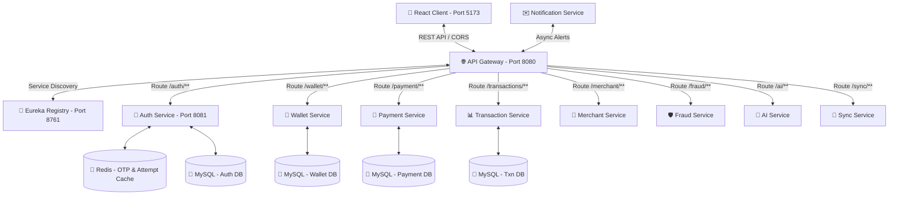

# ⚡ UPI MESH - Modern Fintech UPI Payment Ecosystem

[](https://www.oracle.com/java/)
[](https://spring.io/projects/spring-boot)
[](https://spring.io/projects/spring-cloud)
[](https://react.dev/)
[](https://vitejs.dev/)
[](https://tailwindcss.com/)
[](https://redis.io/)
[](https://www.mysql.com/)

**UPI Mesh** is a state-of-the-art, microservices-driven digital wallet and UPI payment network. Built with a robust **Spring Boot & Spring Cloud** backend and a premium, responsive **React + Tailwind** frontend, the platform replicates real-world fintech transaction processing pipelines, secure auth workflows, fraud prevention networks, and AI-enabled financial assistants.

---

### 🎥 Project Demo Video


---

## 🔮 System Architecture

The ecosystem utilizes a decentralized microservice architecture coordinated via **Netflix Eureka** for service discovery, and routed through a central **Spring Cloud Gateway**.



---

## 🚀 Key Features

### 🔐 1. Bulletproof Authentication & OTP Pipeline
* **Dual Identifiers**: Support for logging in/registering via Email or 10-digit Indian Mobile Numbers.
* **OTP Verification**: Multi-factor authentication via secure, 6-digit OTP codes backed by **Redis** caching with a 5-minute TTL.
* **Brute-Force Rate Limiting**: Limit of 3 OTP requests per 15 minutes per phone number to prevent spam and credential stuffing.
* **JWT Security & Refresh Rotation**: Stateless access token validations with a robust JWT refresh token rotation mechanism for seamless auto-logins.

### 💼 2. Interactive Wallet & Payments
* **Instantly Assigned UPI ID**: Every user receives a standardized `<phone>@upimesh` handle upon successful sign-up.
* **Wallet-to-Wallet Money Transfers**: Instant money transfers utilizing cryptographic transaction flows.
* **Merchant Ecosystem**: Support for registering merchant profiles, scanning static/dynamic QR codes, and executing merchant payments.

### 🛡️ 3. Fraud Monitoring & Limits
* Real-time transaction filtering to prevent anomalous behavior.
* Daily payment limits and instant transaction flags handled through the dedicated **Fraud Service**.

### 🤖 4. AI-Powered Assistant
* Get AI-driven reviews of transaction histories, smart tips, and budgeting answers right inside the dashboard.

### 📱 5. Rich, Dynamic UI (Mobile-First)
* Premium dark-theme glassmorphic styling utilizing Tailwind CSS.
* Subtle micro-animations, loading spinners, state validations, and haptic feedback wrappers to mimic native mobile application quality.

---

## 📂 Microservices Portfolio

| Service Name | Default Port | Primary Technologies | Core Responsibilities |
| :--- | :---: | :--- | :--- |
| **Eureka** | `8761` | Spring Cloud Netflix Eureka | Dynamic service registration and discovery registry. |
| **Gateway** | `8080` | Spring Cloud Gateway, Redis, Resilience4j | Central routing, CORS handling, rate limiting, circuit breaker. |
| **Auth** | `8081` | Spring Boot, Security, JWT, JPA, MySQL, Redis | Registration, login, JWT issuance/rotation, Redis-backed OTPs. |
| **Wallet** | `8082` | Spring Boot, JPA, MySQL | Wallet balance management, deposits, and withdrawal records. |
| **Payment** | `8083` | Spring Boot, JPA, MySQL | Core transaction orchestration between wallets/UPI IDs. |
| **Transaction**| `8084` | Spring Boot, JPA, MySQL | Immutable transaction logs and history tracking. |
| **Merchant** | `8085` | Spring Boot, JPA, MySQL | Merchant onboarding and shop account processing. |
| **Fraud** | `8086` | Spring Boot | Real-time transaction screening and compliance enforcement. |
| **AiService** | `8087` | Spring Boot, AI Models | Natural Language processing for transaction analysis and tips. |
| **Sync** | `8088` | Spring Boot, Apache Kafka / RabbitMQ | Distributed data synchronization across datastores. |
| **Notification**| `8089` | Spring Boot, SMTP / SMS Gateway | Dispatching OTP SMS notifications and emails. |
| **Frontend** | `5173` | Vite, React 18, Tailwind, Zustand, Axios | Mobile-first premium user dashboard. |

---

## 🛠️ Installation & Getting Started

### 📋 Prerequisites
Ensure you have the following installed on your machine:
* **Java Development Kit (JDK) 17** or higher
* **Node.js** (v18+) & **npm**
* **MySQL Database Server**
* **Redis Server** (running locally on port `6379`)

### 🏁 Step 1: Run the Backend Microservices
Run the core services in the following recommended order (ensure Eureka and Gateway are running first):

1. **Start Discovery Registry (Eureka)**:
   ```bash
   cd Eureka/Eureka
   ./mvnw spring-boot:run
   ```
2. **Start API Gateway**:
   ```bash
   cd Gateway/Gateway
   ./mvnw spring-boot:run
   ```
3. **Start Authentication Service (Auth)**:
   ```bash
   cd Auth/Auth
   ./mvnw spring-boot:run
   ```
4. **Start Wallet, Payment, and other services** in their respective directories using:
   ```bash
   ./mvnw spring-boot:run
   ```

### 💻 Step 2: Run the React Frontend
1. Navigate to the frontend directory:
   ```bash
   cd frontend
   ```
2. Install the node packages:
   ```bash
   npm install
   ```
3. Start the Vite development server:
   ```bash
   npm run dev
   ```
4. Open the application in your browser at `http://localhost:5173`.

---

## 🍴 How to Fork & Contribute

We welcome enhancements to the UPI Mesh ecosystem! Follow these steps to fork and contribute:

1. **Fork the Repository**: Click the **Fork** button at the top-right of the page to copy the project to your own account.
2. **Clone your Fork**:
   ```bash
   git clone https://github.com/YOUR_USERNAME/UpiMesh.git
   cd UpiMesh
   ```
3. **Create a Feature Branch**:
   ```bash
   git checkout -b feature/amazing-new-feature
   ```
4. **Commit your Changes**:
   ```bash
   git commit -m "feat: Add amazing new feature"
   ```
5. **Push to your Fork**:
   ```bash
   git push origin feature/amazing-new-feature
   ```
6. **Open a Pull Request**: Submit your pull request to our `main` branch with a description of the improvements.

---

## 📝 License
Distributed under the MIT License. See `LICENSE` for more details.

---

*Made with ❤️ by the UPI Mesh Development Team.*
