# ⚡ UPI MESH - Modern Fintech UPI Payment Ecosystem

[](https://www.oracle.com/java/)
[](https://spring.io/projects/spring-boot)
[](https://spring.io/projects/spring-cloud)
[](https://react.dev/)
[](https://vitejs.dev/)
[](https://tailwindcss.com/)
[](https://redis.io/)
[](https://www.mysql.com/)

**UPI Mesh** is a state-of-the-art, microservices-driven digital wallet and UPI payment network. Built with a robust **Spring Boot & Spring Cloud** backend and a premium, responsive **React + Tailwind** frontend, the platform replicates real-world fintech transaction processing pipelines, secure auth workflows, fraud prevention networks, and AI-enabled financial assistants.

---

### 🎥 Project Demo Video

https://github.com/user-attachments/assets/d5dd39eb-8468-4f7e-8090-f56d46e560d6

## 🔮 System Architecture

The ecosystem utilizes a decentralized microservice architecture coordinated via **Netflix Eureka** for service discovery, and routed through a central **Spring Cloud Gateway**.

```mermaid
graph TD
    Client[📱 React Client - Port 5173] <--> |REST API / CORS| Gateway[🌐 API Gateway - Port 8080]
    Gateway <--> |Service Discovery| Eureka[🧭 Eureka Registry - Port 8761]
    
    Gateway --> |Route /auth/**| AuthService[🔐 Auth Service - Port 8081]
    Gateway --> |Route /wallet/**| WalletService[💼 Wallet Service - Port 8082]
    Gateway --> |Route /payment/**| PaymentService[💸 Payment Service - Port 8083]
    Gateway --> |Route /transactions/**| TxnService[📊 Transaction Service - Port 8084]
    Gateway --> |Route /merchant/**| MerchantService[🏪 Merchant Service - Port 8085]
    Gateway --> |Route /fraud/**| FraudService[🛡️ Fraud Service - Port 8086]
    Gateway --> |Route /ai/**| AiService[🤖 AI Service - Port 8087]
    Gateway --> |Route /sync/**| SyncService[🔄 Sync Service - Port 8088]
    Gateway --> |Route /bank-gateway/**| BankGatewayService[🏦 Bank Gateway - Port 8091]
    Gateway --> |Route /settlement/**| SettlementService[💰 Settlement Service - Port 8092]
    Gateway --> |Route /reconciliation/**| RecService[📊 Reconciliation - Port 8093]
    Gateway --> |Route /kyc/**| KycService[🆔 KYC Service - Port 8094]
    Gateway --> |Route /aml/**| AmlService[🕵️ AML Service - Port 8095]
    Gateway --> |Route /risk/**| RiskService[📊 Risk Service - Port 8096]
    
    AuthService <--> Redis1[(🔴 Redis - OTP & Attempt Cache)]
    AuthService <--> DB_Auth[(🐬 MySQL - Auth DB)]
    WalletService <--> DB_Wallet[(🐬 MySQL - Wallet DB)]
    PaymentService <--> DB_Payment[(🐬 MySQL - Payment DB)]
    TxnService <--> DB_Txn[(🐬 MySQL - Txn DB)]
    KycService <--> Redis2[(🔴 Redis - OTP Cache)]
    AmlService <--> Redis3[(🔴 Redis - Velocity Checks)]
    RiskService <--> Redis4[(🔴 Redis - Scoring Cache)]
    RiskService <--> DB_Risk[(🐬 MySQL - Risk DB)]
    
    NotificationService[✉️ Notification Service] <-- Async Alerts --> Gateway

```



---

## 🚀 Key Features

### 🔐 1. Bulletproof Authentication & OTP Pipeline
* **Dual Identifiers**: Support for logging in/registering via Email or 10-digit Indian Mobile Numbers.
* **OTP Verification**: Multi-factor authentication via secure, 6-digit OTP codes backed by **Redis** caching.
* **Brute-Force Rate Limiting**: Limit of 3 OTP requests per 15 minutes per phone number to prevent spam and credential stuffing.
* **JWT Security & Refresh Rotation**: Stateless access token validations with a robust JWT refresh token rotation mechanism.

### 💼 2. Interactive Wallet & Payments
* **Instantly Assigned UPI ID**: Every user receives a standardized `<phone>@upimesh` handle upon successful sign-up.
* **Wallet-to-Wallet Money Transfers**: Instant money transfers utilizing cryptographic transaction flows.
* **Merchant Ecosystem**: Support for registering merchant profiles, scanning static/dynamic QR codes, and executing merchant payments.

### 🆔 3. Multi-Level KYC Verification (RBI Compliance)
* **Level 0 (Initiation)**: Phone + OTP verification (limit: ₹10,000/month).
* **Level 1 (Basic)**: PAN verification + Aadhaar OTP via UIDAI integration (limit: ₹1,00,000/month).
* **Level 2 (Full)**: Face Match (selfie vs document photo) to unlock unlimited transaction limits.
* **Cryptography**: Sensitive document numbers (Aadhaar/PAN) are encrypted using secure **AES-256-GCM** keys.

### 🕵️ 4. Anti-Money Laundering & Fraud Screening (PMLA 2002)
* **Velocity Rules**: Real-time counter checks using Redis to block users exceeding hourly/daily transaction frequencies.
* **Structuring Detection**: Scans the last 24h transactions to detect splitting behaviors (e.g. sending multiple ₹9,999 transactions to avoid the ₹10,000 alert threshold).
* **Fuzzy Watchlist Screening**: Performs Levenshtein name matching ($\ge$ 80% similarity) against OFAC, UN, and Politically Exposed Persons (PEPs) watchlists.

### 📊 5. ML-Based Real-Time Risk Scoring
* **Multiple Threat Signals**: Evaluates device fingerprint (SHA-256), location anomalies (city checking), timing patterns, and transaction amounts (3x user average) in real-time.
* **Composite Score Calculation**: Calculates a dynamic composite risk score (0.0 to 1.0) and blocks transactions exceeding 0.7 risk threshold.
* **Async User Profiling**: Updates user risk history and profiles asynchronously (rolling averages, evicting old devices) to maintain sub-second transaction response times.

### 💰 6. End-of-Day Settlement & Reconciliation Reports
* **Automatic Settlements**: Executes daily batch processes using **Quartz Schedulers** to group successful merchant transactions and initiate mock NEFT/RTGS/IMPS transfers.
* **RBI Audits & Recon Engine**: Compares internal transaction logs against bank statements to generate reconciliation reports and flag discrepancies (amount mismatches, duplicate debits, missing entries) exported to Excel formats.


---

## 📂 Microservices Portfolio

| Service Name | Default Port | Primary Technologies | Core Responsibilities |
| :--- | :---: | :--- | :--- |
| **Eureka** | `8761` | Spring Cloud Netflix Eureka | Dynamic service registration and discovery registry. |
| **Gateway** | `8080` | Spring Cloud Gateway, Redis, Resilience4j | Central routing, CORS handling, rate limiting, circuit breaker. |
| **Auth** | `8081` | Spring Boot, Security, JWT, JPA, MySQL, Redis | Registration, login, JWT issuance/rotation, Redis-backed OTPs. |
| **Wallet** | `8082` | Spring Boot, JPA, MySQL | Wallet balance management, deposits, and withdrawal records. |
| **Payment** | `8083` | Spring Boot, JPA, MySQL | Core transaction orchestration between wallets/UPI IDs. |
| **Transaction**| `8084` | Spring Boot, JPA, MySQL | Immutable transaction logs and history tracking. |
| **Merchant** | `8085` | Spring Boot, JPA, MySQL | Merchant onboarding and shop account processing. |
| **Fraud** | `8086` | Spring Boot | Real-time transaction screening and compliance enforcement. |
| **AiService** | `8087` | Spring Boot, AI Models | Natural Language processing for transaction analysis and tips. |
| **Sync** | `8088` | Spring Boot, Apache Kafka / RabbitMQ | Distributed data synchronization across datastores. |
| **Notification**| `8089` | Spring Boot, SMTP / SMS Gateway | Dispatching OTP SMS notifications and emails. |
| **BankGateway**| `8091` | Spring Boot, Feign, Resilience4j | Strategy Pattern interface connecting with Indian banks (HDFC, SBI, ICICI, etc.). |
| **Settlement** | `8092` | Spring Boot, JPA, Quartz Scheduler | Batch settlements for merchants grouped by account configurations. |
| **Reconciliation**| `8093` | Spring Boot, Apache POI, Quartz | EOD audit checks matching system ledger values with bank statements. |
| **KycService** | `8094` | Spring Boot, WebFlux, Redis, AES-GCM | UIDAI/NSDL identity validations and limit updates. |
| **AmlService** | `8095` | Spring Boot, Redis, MySQL, Levenshtein | Money laundering checks: velocity limits, structuring, PEP watchlists. |
| **RiskScoring**| `8096` | Spring Boot, Redis, MySQL, Async | Real-time ML-like risk evaluation: device fingerprinting, location, amount, time patterns. |
| **Frontend** | `5173` | Vite, React 18, Tailwind, Zustand, Axios | Mobile-first premium user dashboard. |


---

## 🛠️ Installation & Getting Started

### 🐳 Quick Start with Docker Compose (Recommended)

Run the entire platform (Infrastructure + Service Discovery + API Gateway + 24 Domain Microservices) with a single command:

1. **Setup Environment Variables**:
   ```bash
   cp .env.example .env
   ```
2. **Start Complete Platform**:
   ```bash
   docker compose up -d
   ```
3. **Verify Service Health**:
   ```bash
   docker compose ps
   ```
4. **Access Eureka Dashboard**: Open `http://localhost:8761` (Login: `admin` / `admin123`)

For full runbook, container logs, rebuilding single services, and troubleshooting, see [docs/runbooks/local-development.md](docs/runbooks/local-development.md).

---

### 💻 Manual Development Setup (Maven)

Ensure you have **JDK 17**, **Node.js 18+**, **MySQL**, and **Redis** running locally.

1. **Start Discovery Registry (Eureka)**:
   ```bash
   cd Eureka/Eureka
   mvn spring-boot:run
   ```
2. **Start API Gateway**:
   ```bash
   cd Gateway/Gateway
   mvn spring-boot:run
   ```
3. **Start Authentication Service (Auth)**:
   ```bash
   cd Auth/Auth
   mvn spring-boot:run
   ```
4. **Start the remaining business services** (Wallet, Payment, KycService, AmlService, etc.) in their respective directories using:
   ```bash
   ./mvnw spring-boot:run
   ```

### 💻 Step 2: Run the React Frontend
1. Navigate to the frontend directory:
   ```bash
   cd frontend
   ```
2. Install the node packages:
   ```bash
   npm install
   ```
3. Start the Vite development server:
   ```bash
   npm run dev
   ```
4. Open the application in your browser at `http://localhost:5173`.

---

## 🍴 How to Fork & Contribute

We welcome enhancements to the UPI Mesh ecosystem! Follow these steps to fork and contribute:

1. **Fork the Repository**: Click the **Fork** button at the top-right of the page to copy the project to your own account.
2. **Clone your Fork**:
   ```bash
   git clone https://github.com/YOUR_USERNAME/UpiMesh.git
   cd UpiMesh
   ```
3. **Create a Feature Branch**:
   ```bash
   git checkout -b feature/amazing-new-feature
   ```
4. **Commit your Changes**:
   ```bash
   git commit -m "feat: Add amazing new feature"
   ```
5. **Push to your Fork**:
   ```bash
   git push origin feature/amazing-new-feature
   ```
6. **Open a Pull Request**: Submit your pull request to our `main` branch with a description of the improvements.

---

## 📝 License
Distributed under the MIT License. See `LICENSE` for more details.

---

*Made with ❤️ by the UPI Mesh Development Team.*
