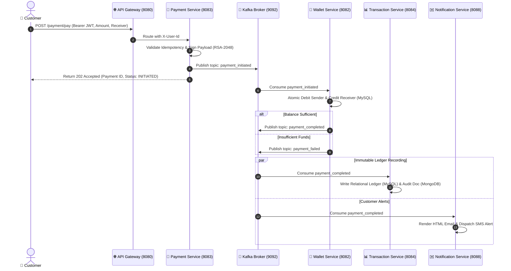
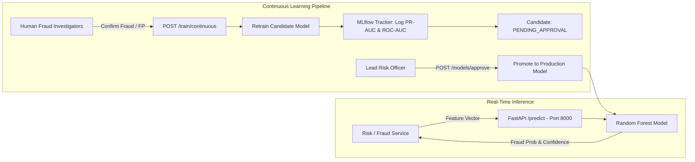

# ⚡ UPI MESH & SENTINELX — Enterprise Fintech & Payment Mesh Ecosystem

[](https://www.oracle.com/java/)
[](https://spring.io/projects/spring-boot)
[](https://spring.io/projects/spring-cloud)
[](https://www.python.org/)
[](https://fastapi.tiangolo.com/)
[](https://react.dev/)
[](https://nextjs.org/)
[](https://kafka.apache.org/)
[](https://redis.io/)
[](https://www.mysql.com/)
[](https://www.mongodb.com/)
[](https://www.docker.com/)
[](https://kubernetes.io/)
[](LICENSE)

---

## 🏛️ Executive Summary

**UPI Mesh & SentinelX** is an enterprise-grade, distributed financial technology ecosystem engineered to replicate and extend India’s **Unified Payments Interface (UPI 2.0)** national switch architecture. Designed by a 15+ years veteran distributed systems architect, the platform addresses the complexities of high-throughput real-time retail payments, multi-tier regulatory compliance, offline cryptographic mesh synchronization, and machine learning fraud defense.

The platform orchestrates **27 distinct microservices** (24 Spring Boot domain services, Netflix Eureka Discovery Registry, reactive Spring Cloud API Gateway, and a dedicated Python FastAPI Machine Learning engine) communicating across synchronous REST meshes, reactive Redis token buckets, and asynchronous Apache Kafka event streams.

### 🎥 Project Demo Video
https://github.com/user-attachments/assets/d5dd39eb-8468-4f7e-8090-f56d46e560d6

---

## 📖 Key Documentation Sitemap

| Document | Primary Focus | Target Audience |
|---|---|---|
| [**`docs/ALGORITHMS_AND_MATHEMATICAL_MODELS.md`**](docs/ALGORITHMS_AND_MATHEMATICAL_MODELS.md) | Formulations, equations, pseudocode, and time complexity for all 12 platform algorithms. | Quantitative Engineers, Data Scientists, Core Developers |
| [**`docs/SERVICES_ARCHITECTURE_CATALOG.md`**](docs/SERVICES_ARCHITECTURE_CATALOG.md) | Granular inventory of all 27 microservices: ports, DB schemas, REST endpoints, and Kafka topics. | Backend Engineers, DevOps, System Integrators |
| [**`docs/SECURITY_CRYPTOGRAPHY_COMPLIANCE.md`**](docs/SECURITY_CRYPTOGRAPHY_COMPLIANCE.md) | Zero-Trust perimeter, AES-256-GCM, RSA-2048, threat matrix, and RBI/PMLA/DPDP compliance audits. | SecOps, Compliance Officers, Auditors |
| [**`docs/runbooks/local-development.md`**](docs/runbooks/local-development.md) | Comprehensive runbook for Docker Compose and local development workflows. | All Developers & Contributors |
| [**`docs/DEPLOYMENT_ROLLBACK_GUIDE.md`**](docs/DEPLOYMENT_ROLLBACK_GUIDE.md) | Blue/Green deployment, canary rollout, and emergency rollback procedures. | SRE, Release Managers, DevOps |
| [**`LICENSE`**](LICENSE) | Formal Open Source MIT License with copyright and liability disclaimers. | Legal & Open Source Users |

---

## 🔮 System Topologies & Distributed Architecture

### 1. Synchronous Perimeter & Edge Routing Mesh
Clients interface with the platform exclusively through the **Spring Cloud API Gateway**, which terminates TLS, applies reactive Redis token-bucket rate limits, verifies stateless JWTs, strips spoofed headers, and injects authenticated identity headers (`X-User-Id`, `X-User-Roles`).

```mermaid
graph TD
    Client[📱 Web / Mobile Client - Port 5173 / 3000] <--> |TLS 1.3 / REST| Gateway[🌐 API Gateway - Port 8080]
    Gateway <--> |Heartbeat / Discovery| Eureka[🧭 Eureka Registry - Port 8761]
    
    subgraph Core Financial Operations
        Gateway --> |/auth/**| Auth[🔐 Auth Service - Port 8081]
        Gateway --> |/wallet/**| Wallet[💼 Wallet Service - Port 8082]
        Gateway --> |/payment/**| Payment[💸 Payment Service - Port 8083]
        Gateway --> |/transactions/**| Txn[📊 Transaction Service - Port 8084]
        Gateway --> |/sync/**| Sync[🔄 Sync Service - Port 8089]
    end

    subgraph Business & Merchant Services
        Gateway --> |/merchant/**| Merchant[🏪 Merchant Service - Port 8085]
        Gateway --> |/invoice/**| Invoice[🧾 Invoice Service - Port 8099]
        Gateway --> |/payroll/**| Payroll[💼 Payroll Service - Port 8104]
        Gateway --> |/dispute/**| Dispute[⚖️ Dispute Service - Port 8100]
        Gateway --> |/subscription/**| Sub[🔁 Subscription Service - Port 8098]
        Gateway --> |/loan/**| Loan[💳 Loan / BNPL Service - Port 8102]
        Gateway --> |/rewards/**| Rewards[🎁 Rewards Service - Port 8101]
        Gateway --> |/referral/**| Referral[👥 Referral Service - Port 8103]
    end

    subgraph Regulatory & Banking Rails
        Gateway --> |/bank-gateway/**| BankGw[🏦 Bank Gateway - Port 8091]
        Gateway --> |/npci/**| NPCI[🏛️ NPCI Switch - Port 8090]
        Gateway --> |/settlement/**| Settlement[💰 Settlement - Port 8092]
        Gateway --> |/reconciliation/**| Recon[📑 Reconciliation - Port 8093]
        Gateway --> |/kyc/**| Kyc[🆔 KYC Service - Port 8094]
        Gateway --> |/aml/**| Aml[🕵️ AML Service - Port 8095]
        Gateway --> |/risk/**| Risk[🛡️ Risk Service - Port 8096]
        Gateway --> |/fraud/**| Fraud[🚨 Fraud Service - Port 8086]
        Gateway --> |/ai/**| AI[🤖 AI Service - Port 8087]
        Gateway --> |/analytics/**| Analytics[📈 Analytics - Port 8105]
    end
```



---

### 2. Asynchronous Event Bus & Distributed Ledger
High-throughput transaction lifecycle steps are decoupled via **Apache Kafka**, ensuring non-blocking, eventual consistency across polyglot datastores (MySQL relational ledgers and MongoDB audit journals).



---

### 3. SentinelX ML Continuous Learning Architecture
In addition to rule-based heuristics, real-time fraud inference and continuous learning are executed via a dedicated Python microservice communicating with an **MLflow Experiment Registry**.



---

## 📂 Complete 27-Service Portfolio Matrix

| Service Name | Default Port | Technology Stack | Primary Backing Store | Core Responsibilities |
|---|:---:|---|---|---|
| **Eureka** | `8761` | Spring Cloud Netflix Eureka | In-Memory Registry | Dynamic service registration, node health heartbeats, and cluster discovery. |
| **Gateway** | `8080` | Spring Cloud Gateway, Reactive Redis | Reactive Redis | Edge reverse proxy, CORS handling, JWT claim extraction, and token-bucket rate limiting. |
| **Auth** | `8081` | Spring Boot, Security, JJWT, MySQL | MySQL (`upi_auth_db`) + Redis | Identity provider, OTP issuance via Redis, BCrypt hashing, and JWT refresh token rotation. |
| **Wallet** | `8082` | Spring Boot, JPA, Spring Kafka | MySQL (`upi_wallet_db`) + Redis | Real-time wallet balance management, top-ups, and atomic credit/debit execution. |
| **Payment** | `8083` | Spring Boot, JPA, Kafka, RSA | MySQL (`upi_payment_db`) | Core payment orchestration, idempotency checking, RSA-2048 signing, and Kafka event publishing. |
| **Transaction**| `8084` | Spring Boot, JPA, MongoDB, Kafka | MySQL (`upi_transaction_db`) + Mongo | Polyglot immutable ledger, paginated transaction history, and user spending analytics. |
| **Merchant** | `8085` | Spring Boot, JPA, ZXing | MySQL (`upi_merchant_db`) | Merchant onboarding, store profile configuration, and static/dynamic UPI QR code generation. |
| **Fraud** | `8086` | Spring Boot, Redis, Kafka | In-Memory / Mongo (`upi_fraud_db`)| Rule-based transaction screening (rapid velocity, duplicate amounts, unusual night hours). |
| **AiService** | `8087` | Spring Boot, Spring AI, OpenAI | MongoDB (`upi_ai_db`) | Conversational banking copilot, expenditure categorization, and natural-language fraud explanations. |
| **Notification**| `8088`| Spring Boot, Spring Kafka, Mail | In-Memory / SMTP | Event-driven customer alert dispatcher consuming Kafka topics to send emails and SMS messages. |
| **Sync** | `8089` | Spring Boot, JPA, Kafka, Feign | MySQL (`upi_sync_db`) | Offline mesh payment synchronization, nonce validation, and reconciliation upon reconnect. |
| **NPCI** | `8090` | Spring Boot, JPA, Feign, AES-GCM | MySQL (`npci_db`) + Redis | Simulates the National Payments Corporation of India (NPCI) UPI Switch, mandates, and ISO-8583 codes. |
| **BankGateway**| `8091` | Spring Boot, JPA, Feign, Strategy | MySQL (`bank_gateway_db`) + Redis | Commercial bank abstraction (HDFC, SBI, ICICI, Axis, Kotak), balance inquiries, and IFSC resolution. |
| **Settlement** | `8092` | Spring Boot, JPA, Quartz Scheduler | MySQL (`settlement_db`) | Automated midnight merchant batch settlement, 0.2% fee deduction, 18% GST calculation, and payouts. |
| **Reconciliation**| `8093`| Spring Boot, Apache POI, Quartz | MySQL (`reconciliation_db`)| EOD 3-way ledger audit matching internal records with external bank feeds, exporting to Excel (.xlsx). |
| **KycService** | `8094` | Spring Boot, JPA, AES-256-GCM | MySQL (`kyc_db`) + Redis | Multi-tier KYC verification (Tier 0: OTP, Tier 1: PAN/Aadhaar, Tier 2: Face Match) with field-level encryption. |
| **AmlService** | `8095` | Spring Boot, JPA, Redis, Levenshtein | MySQL (`aml_db`) + Redis | Anti-Money Laundering screening (PMLA 2002): velocity checks, anti-smurfing, and fuzzy PEP watchlist matching. |
| **RiskScoring**| `8096` | Spring Boot, JPA, Strategy Pattern | MySQL (`risk_db`) + Redis | Real-time multi-signal behavioral risk scoring (0-100) evaluating 9 modular heuristic rule evaluators. |
| **Subscription**| `8098` | Spring Boot, JPA, Quartz Scheduler | MySQL (`subscription_db`) | UPI AutoPay recurring mandate lifecycle management, automated billing execution, and 3-step dunning retries. |
| **Invoice** | `8099` | Spring Boot, JPA, iText7 | MySQL (`invoice_db`) + Redis | Merchant billing engine: tax calculation (CGST/SGST/IGST), discount tiers, and PDF invoice generation. |
| **Dispute** | `8100` | Spring Boot, JPA, OpenFeign | MySQL (`dispute_db`) + Redis | Customer dispute arbitration, 90-day eligibility enforcement, 48-hour merchant rebuttal SLA, and refunds. |
| **Rewards** | `8101` | Spring Boot, JPA, Redis | MySQL (`rewards_db`) + Redis | User loyalty points ledger, referral bonuses, promotional campaigns, and wallet credit redemptions. |
| **Loan** | `8102` | Spring Boot, JPA, OpenFeign | MySQL (`loan_db`) | Digital micro-lending / BNPL, CIBIL credit scoring simulation, and reducing-balance EMI amortization. |
| **Referral** | `8103` | Spring Boot, JPA, Redis | MySQL (`referral_db`) + Redis | Customer referral code issuance, conversion tracking, and device-fingerprint fraud prevention. |
| **Payroll** | `8104` | Spring Boot, JPA, iText7, Feign | MySQL (`payroll_db`) | Corporate bulk payroll disbursements, statutory deductions (PF, ESI, TDS), and PDF pay slip generation. |
| **Analytics** | `8105` | Spring Boot, JPA, Redis | MySQL (`analytics_db`) + Redis | Financial intelligence engine computing hourly/daily GMV, transaction volumes, and user adoption metrics. |
| **MlService** | `8000` | Python 3.11, FastAPI, Scikit-Learn | File / Memory / MLflow | Standalone SentinelX ML fraud inference engine, continuous training, PR-AUC evaluation, and human approval gate. |

---

## 🧠 Core Engineering Algorithms & Formulations

For complete mathematical derivations, proofs, pseudocode, and time complexity analyses, consult the dedicated specification:  
👉 [**`docs/ALGORITHMS_AND_MATHEMATICAL_MODELS.md`**](docs/ALGORITHMS_AND_MATHEMATICAL_MODELS.md)

### Algorithmic Highlights:
1. **Fuzzy Sanctions Screening (Levenshtein DP):**
   Evaluates string edit distance over dynamic programming matrix $\mathcal{O}(m \cdot n)$ to compute normalized similarity $S(s_1, s_2) = 1.0 - \frac{D(s_1, s_2)}{\max(|s_1|, |s_2|)}$. Intercepts PEP/OFAC variations with match threshold $S \ge 0.80$.
2. **Sliding-Window Velocity Tracking:**
   Maintains atomic Redis token counters with TTL auto-expiration: hourly key `vel:h:<user>` ($L_{\text{hour}} = 10$) and daily key `vel:d:<user>` ($L_{\text{day}} = 25$).
3. **Anti-Smurfing Structuring Detection:**
   Scans rolling 24-hour transaction histories to identify deliberate evasion patterns clustering just below statutory reporting thresholds ($\Omega_{10K} = [₹9,000, ₹9,999.99]$ and $\Omega_{50K} = [₹45,000, ₹49,999.99]$).
4. **Dynamic Composite Risk Scoring Engine:**
   Aggregates 9 independent rule strategies (device fingerprint, amount deviation $> 3\sigma$, location jumps, night hours, new beneficiary, burst velocity) into a bounded score $S \in [0.0, 100.0]$ with 5 decision tiers (`ALLOW`, `MONITOR`, `STEP_UP`, `REVIEW`, `BLOCK`).
5. **Continuous Learning ML Fraud Engine:**
   Trains an ensemble Random Forest classifier on 8-dimensional normalized feature vectors. Evaluates Precision, Recall, F1, ROC-AUC, and PR-AUC. Employs a strict **human-in-the-loop candidate model approval gate** in MLflow before production deployment.
6. **Asymmetric Offline Payment Mesh (RSA-2048):**
   Enables peer-to-peer transfers in zero-connectivity zones via canonical payload hashing (`SHA-256`) and client-side private key signing (`SHA256withRSA`). Signatures are cryptographically verified upon network reconnection, guaranteeing non-repudiation.
7. **Authenticated Field-Level Symmetric Encryption (AES-256-GCM):**
   Encrypts regulatory PII (Aadhaar, PAN, bank accounts) using 256-bit AES in Galois/Counter Mode with 12-byte secure random IVs and 128-bit authentication tags, preventing padding oracle and bit-flipping attacks.
8. **3-Way Financial Reconciliation Engine:**
   Tri-matches internal ledger records against external bank feeds and NPCI reports across RRN, NPCI ID, and Internal ID keys. Automatically isolates `DUPLICATE_IN_BANK`, `AMOUNT_MISMATCH`, and `MISSING_IN_BANK` entries into Excel workbooks.
9. **Automated EOD Merchant Settlement:**
   Computes platform fees ($0.2\%$ capped between ₹1.00 and ₹1,000.00), applies 18% GST, and dynamically selects clearing rails: RTGS ($\ge ₹200,000$), NEFT ($\ge ₹1,000$), or IMPS ($< ₹1,000$).
10. **Reducing-Balance Loan EMI Amortization:**
    Calculates monthly installments using $EMI = \frac{P \cdot r \cdot (1+r)^n}{(1+r)^n - 1}$ with `RoundingMode.HALF_UP` precision, generates detailed interest/principal amortization tables, and enforces daily overdue penalties.
11. **Statutory Payroll Deductions:**
    Implements Indian labor statutory rules: basic salary capped at 50% gross, Provident Fund (12% on basic capped at ₹1,800), Employee State Insurance (0.75% for gross $\le ₹21,000$), and progressive annual income tax TDS slab projections.
12. **RBI AutoPay Mandate Dunning State Machine:**
    Executes automated recurring debits and enforces an exponential 3-step dunning retry schedule (Day 0 $\rightarrow$ Day +1 $\rightarrow$ Day +3) before updating status to `PAYMENT_FAILED` and revoking the mandate.

---

## 🔒 Security, Cryptography & Compliance Architecture

For complete threat models, key management runbooks, and regulatory audit mappings, consult:  
👉 [**`docs/SECURITY_CRYPTOGRAPHY_COMPLIANCE.md`**](docs/SECURITY_CRYPTOGRAPHY_COMPLIANCE.md)

### Regulatory Compliance Mapping

| Regulatory Body / Act | Mandated Standard | UPI Mesh Architecture Implementation |
|---|---|---|
| **RBI Master Directions (PPIs)** | Tiered KYC transaction limits | Enforces Tier 0 (₹10K/mo), Tier 1 (₹1L/mo), and Tier 2 (Unlimited) via `KycService`. |
| **RBI e-Mandate Circulars** | Pre-debit notifications & dunning | 3-step dunning retry state machine in `SubscriptionService` with automated customer/merchant notifications. |
| **PMLA 2002 (AML Compliance)** | Sanctions match & anti-smurfing | Real-time Levenshtein fuzzy matching ($\ge 80\%$) and sub-threshold structuring detection in `AmlService`. |
| **DPDP Act 2023** | Data minimization & PII protection | Field-level AES-256-GCM encryption of Aadhaar and PAN numbers; strict role-based access control. |
| **PCI-DSS Level 1** | Defense-in-depth & network isolation | Segregated Docker/Kubernetes container networks; BCrypt password hashing; immutable MongoDB audit trails. |

---

## 📁 Repository Directory Structure

```
d:\UpiMesh
├── .env.example                       # Master environment variable template
├── docker-compose.yml                 # Full stack orchestration (Infra + 27 Services)
├── LICENSE                            # Official MIT Open Source License
├── README.md                          # Master architectural specification
│
├── Eureka/Eureka/                     # Port 8761: Netflix Eureka Service Registry
├── Gateway/Gateway/                   # Port 8080: Reactive Spring Cloud API Gateway
│
├── Auth/Auth/                         # Port 8081: Identity, BCrypt, JWT & Redis OTP
├── Wallet/Wallet/                     # Port 8082: Balance Ledger & Credit/Debit
├── Payment/Payment/                   # Port 8083: Payment Orchestrator, Kafka, RSA Signing
├── Transaction/Transaction/           # Port 8084: Polyglot Ledger (MySQL + MongoDB)
├── Merchant/Merchant/                 # Port 8085: Merchant Onboarding & QR Generation
├── Fraud/Fraud/                       # Port 8086: Rule-Based Fraud Detection
├── AiService/AiService/               # Port 8087: Spring AI & OpenAI Financial Assistant
├── Notification/Notification/         # Port 8088: Kafka Consumer, SMTP Email & SMS Dispatch
├── Sync/Sync/                         # Port 8089: Offline Payment Mesh Synchronization
├── NPCI/NPCI/                         # Port 8090: Simulated NPCI UPI Switch & Mandates
├── BankGateway/BankGateway/           # Port 8091: Strategy-Based Core Banking (HDFC/SBI/etc.)
├── Settlement/Settlement/             # Port 8092: EOD Daily Batch Settlement & GST Calc
├── Reconciliation/Reconciliation/     # Port 8093: 3-Way Bank vs Ledger Reconciliation
├── Kyc/Kyc/                           # Port 8094: UIDAI/NSDL KYC & AES-256-GCM Encryption
├── Aml/Aml/                           # Port 8095: Anti-Money Laundering & Sanctions Match
├── Risk/Risk/                         # Port 8096: 9-Rule Composite Behavioral Risk Scoring
├── Subscription/Subscription/         # Port 8098: UPI AutoPay Recurring Mandates & Dunning
├── Invoice/Invoice/                   # Port 8099: B2B Invoicing & iText7 PDF Generation
├── Dispute/Dispute/                   # Port 8100: Chargebacks, Dispute SLAs & Arbitration
├── Rewards/Rewards/                   # Port 8101: Loyalty Points & Cashback Ledger
├── Loan/Loan/                         # Port 8102: BNPL Lending & EMI Amortization Schedule
├── Referral/Referral/                 # Port 8103: Referral Tracking & Device Anti-Fraud
├── Payroll/Payroll/                   # Port 8104: Corporate Salary Disbursal & Pay Slips
├── Analytics/Analytics/               # Port 8105: Financial KPI & Metric Aggregation
│
├── MlService/                         # Port 8000: Python FastAPI SentinelX ML Engine
│   ├── main.py                        # FastAPI endpoints (/predict, /train, /models/approve)
│   ├── ml_engine.py                   # Random Forest, feature validation, PR-AUC evaluation
│   ├── mlflow_tracker.py              # Candidate model registry and deployment gates
│   └── requirements.txt               # Scikit-Learn, Pandas, FastAPI, Uvicorn
│
├── frontend/                          # Port 5173 / 3000: Next.js 14 / React 18 Mobile App
├── k8s/                               # Kubernetes manifests (Deployments, Ingress, Secrets)
├── observability/                     # Prometheus scraping configs & Grafana dashboards
├── docker/mysql/init.sql              # MySQL initialization script for 21 database schemas
└── docs/                              # Dedicated architectural deep-dive guides
    ├── ALGORITHMS_AND_MATHEMATICAL_MODELS.md
    ├── SERVICES_ARCHITECTURE_CATALOG.md
    ├── SECURITY_CRYPTOGRAPHY_COMPLIANCE.md
    ├── DEPLOYMENT_ROLLBACK_GUIDE.md
    └── runbooks/local-development.md
```

---

## 🛠️ Quick Start & Local Development

### 1. Unified Docker Compose Deployment (Recommended)
You can bootstrap the entire enterprise stack (MySQL, Redis, MongoDB, Zookeeper, Kafka, Eureka, API Gateway, 24 domain microservices, and the SentinelX ML engine) with a single command:

```bash
# 1. Clone the repository
git clone https://github.com/YOUR_ORGANIZATION/UpiMesh.git
cd UpiMesh

# 2. Configure environment parameters
cp .env.example .env

# 3. Launch complete containerized platform in detached mode
docker compose up -d

# 4. Verify running container health
docker compose ps
```

- **Eureka Service Dashboard:** Open [`http://localhost:8761`](http://localhost:8761) (Credentials: `admin` / `admin123`).
- **API Gateway Edge:** Live at [`http://localhost:8080`](http://localhost:8080).
- **SentinelX ML Service Docs:** Open Swagger UI at [`http://localhost:8000/docs`](http://localhost:8000/docs).
- **Web Frontend Dashboard:** Open [`http://localhost:5173`](http://localhost:5173) (or `3000`).

---

### 2. Manual Bare-Metal Development (Java 17 + Maven)
For active microservice feature development, ensure **JDK 17**, **Node.js 18+**, **MySQL 8**, and **Redis 7** are installed locally.

```bash
# Step 1: Start Discovery Registry (Eureka)
cd Eureka/Eureka
mvn spring-boot:run

# Step 2: Start Edge API Gateway (in new terminal)
cd Gateway/Gateway
mvn spring-boot:run

# Step 3: Start Identity & Core Services
cd Auth/Auth && mvn spring-boot:run
cd Wallet/Wallet && mvn spring-boot:run
cd Payment/Payment && mvn spring-boot:run

# Step 4: Start SentinelX ML Service (Python virtual environment)
cd MlService
python -m venv .venv
source .venv/bin/activate  # Or on Windows: .venv\Scripts\activate
pip install -r requirements.txt
python main.py

# Step 5: Start React / Next.js Web Client
cd frontend
npm install
npm run dev
```

---

### 3. Kubernetes (K8s) Cluster Deployment
Production deployments leverage the declarative manifests in `k8s/`:

```bash
# 1. Create dedicated namespace and secrets
kubectl apply -f k8s/namespace.yaml
kubectl apply -f k8s/secrets.yaml
kubectl apply -f k8s/configmap.yaml

# 2. Deploy core infrastructure and domain microservices
kubectl apply -f k8s/gateway-deployment.yaml
kubectl apply -f k8s/transaction-deployment.yaml
kubectl apply -f k8s/fraud-deployment.yaml
kubectl apply -f k8s/ml-service-deployment.yaml
kubectl apply -f k8s/ingress.yaml

# 3. Check pod status
kubectl get pods -n upimesh -o wide
```

---

## 🤝 How to Fork & Contribute

We welcome contributions from fintech engineers and distributed systems researchers!

1. **Fork the Repository**: Click the **Fork** button at the top-right of GitHub.
2. **Clone your Fork**:
   ```bash
   git clone https://github.com/YOUR_USERNAME/UpiMesh.git
   cd UpiMesh
   ```
3. **Create a Feature Branch**:
   ```bash
   git checkout -b feature/advanced-fraud-graph
   ```
4. **Commit your Changes**:
   ```bash
   git commit -m "feat(fraud): Add graph neural network cluster detection"
   ```
5. **Push & Open Pull Request**: Push to your branch and submit a PR against `main`.

---

## 📝 License & Compliance Disclaimer

Distributed under the **MIT License**. See [`LICENSE`](LICENSE) for complete terms.

> **Regulatory Notice:** This project includes architectural simulations of commercial banks, the NPCI switch, UIDAI Aadhaar verification, and NSDL PAN APIs for educational, research, and platform engineering purposes. In a live production banking environment, connect via licensed Bank Sponsorship and authorized NPCI Member Bank APIs.

---

*Authored with ❤️ and architectural rigor by the UPI Mesh Development Team.*
