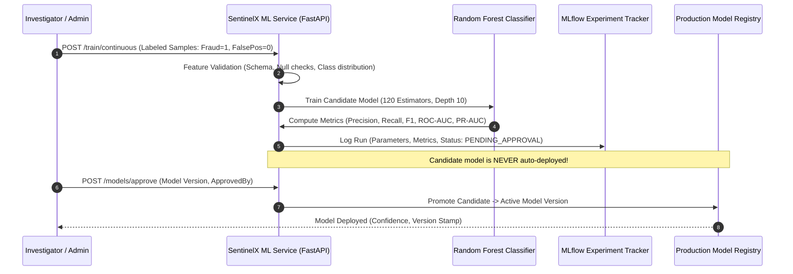
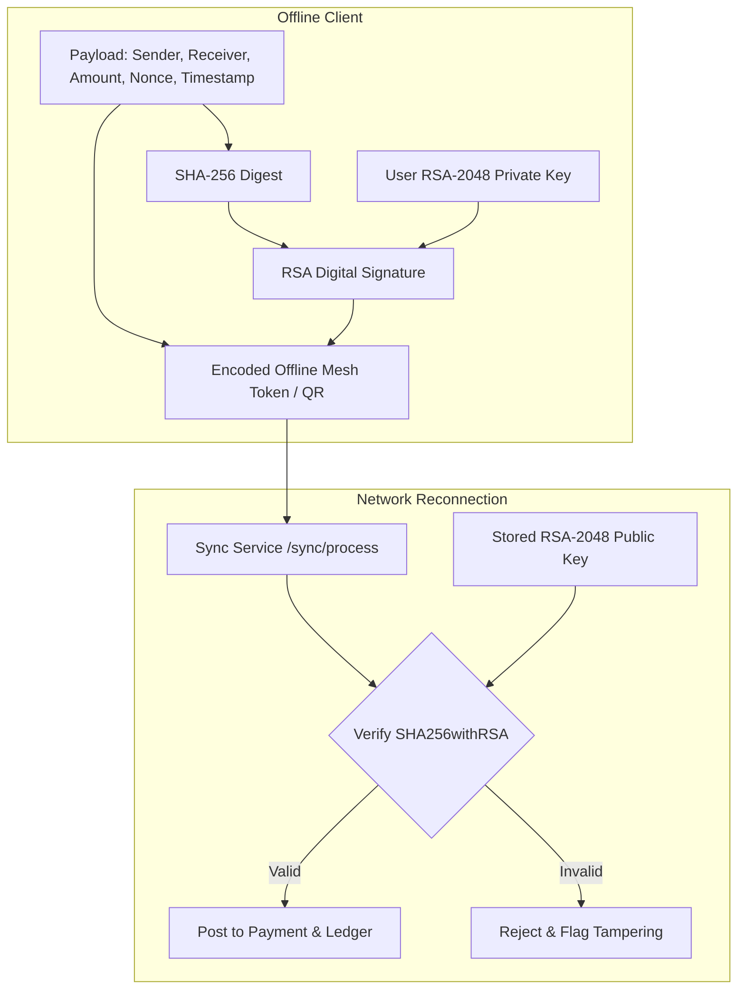
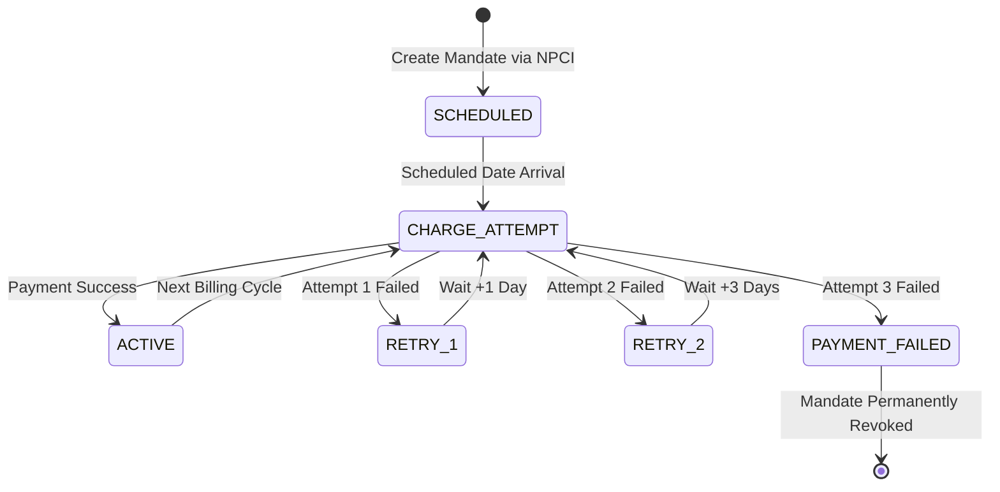

# UPI Mesh & SentinelX — Core Algorithms & Mathematical Formulations

> **Author:** 15+ Years Principal Fintech & Distributed Systems Architect  
> **Classification:** Engineering & Algorithmic Specification  
> **Target System:** UPI Mesh Microservices Platform & SentinelX Fraud Engine  

---

## Table of Contents
1. [Executive Overview](#1-executive-overview)
2. [Algorithm 1: AML Fuzzy Watchlist Screening (Levenshtein DP)](#2-algorithm-1-aml-fuzzy-watchlist-screening-levenshtein-dp)
3. [Algorithm 2: AML Sliding Window Velocity Checking (Redis Token Counters)](#3-algorithm-2-aml-sliding-window-velocity-checking-redis-token-counters)
4. [Algorithm 3: AML Structuring & Anti-Smurfing Detection](#4-algorithm-3-aml-structuring--anti-smurfing-detection)
5. [Algorithm 4: Real-Time Composite Risk Scoring Engine (Multi-Signal Heuristic)](#5-algorithm-4-real-time-composite-risk-scoring-engine-multi-signal-heuristic)
6. [Algorithm 5: SentinelX ML Fraud Predictor & Continuous Learning (Random Forest & PR-AUC)](#6-algorithm-5-sentinelx-ml-fraud-predictor--continuous-learning-random-forest--pr-auc)
7. [Algorithm 6: Asymmetric Offline Payment Cryptography (RSA-2048 & SHA-256)](#7-algorithm-6-asymmetric-offline-payment-cryptography-rsa-2048--sha-256)
8. [Algorithm 7: Authenticated Field-Level Symmetric Encryption (AES-256-GCM)](#8-algorithm-7-authenticated-field-level-symmetric-encryption-aes-256-gcm)
9. [Algorithm 8: 3-Way Financial Ledger Reconciliation Engine](#9-algorithm-8-3-way-financial-ledger-reconciliation-engine)
10. [Algorithm 9: Automated EOD Merchant Settlement & Tiered Clearing](#10-algorithm-9-automated-eod-merchant-settlement--tiered-clearing)
11. [Algorithm 10: Reducing Balance Loan EMI & Amortization Engine](#11-algorithm-10-reducing-balance-loan-emi--amortization-engine)
12. [Algorithm 11: Statutory Payroll Deduction & Progressive Tax Slabs](#12-algorithm-11-statutory-payroll-deduction--progressive-tax-slabs)
13. [Algorithm 12: Recurring AutoPay Mandate & RBI Dunning Retry Machine](#13-algorithm-12-recurring-autopay-mandate--rbi-dunning-retry-machine)

---

## 1. Executive Overview

In enterprise fintech, software correctness is inseparable from financial integrity and regulatory compliance. The UPI Mesh platform processes real-time peer-to-peer (P2P), peer-to-merchant (P2M), offline mesh transfers, and corporate disbursements. 

To satisfy requirements mandated by the **Reserve Bank of India (RBI)**, the **Prevention of Money Laundering Act (PMLA 2002)**, the **Digital Personal Data Protection Act (DPDP 2023)**, and **PCI-DSS**, the system implements 12 foundational algorithmic models spanning:
- **String Distance Metrics & NLP** for sanction/PEP watchlists.
- **Sliding-Window Aggregators & Rate Limiters** for velocity and smurfing defense.
- **Statistical & Tree-Based Machine Learning** for behavioral fraud mitigation.
- **Asymmetric & Symmetric Cryptography** for offline tamper-proofing and data-at-rest protection.
- **Deterministic Multi-Way Reconciliation** for zero-loss financial ledgers.
- **Actuarial & Amortization Formulas** for loans and statutory payroll disbursements.

---

## 2. Algorithm 1: AML Fuzzy Watchlist Screening (Levenshtein DP)

### Business Context & Compliance
Under **PMLA 2002** and global **FATF (Financial Action Task Force)** recommendations, financial institutions must screen all transacting counterparties against designated sanctions lists (UNSC, OFAC SDN, and national Politically Exposed Persons (PEP) registries). Fraudsters routinely evade exact string matching by introducing misspellings, character transpositions, or honorific variations (e.g., "Mohammad" vs. "Muhammed").

### Mathematical Formulation
The Levenshtein Distance $D(s_1, s_2)$ between two strings $s_1$ of length $m$ and $s_2$ of length $n$ is defined recursively:

$$
D_{i,j} = \begin{cases} 
\max(i, j) & \text{if } \min(i, j) = 0, \\
\min \begin{cases} 
D_{i-1, j} + 1 \\ 
D_{i, j-1} + 1 \\ 
D_{i-1, j-1} + \mathbb{I}(s_1[i] \neq s_2[j]) 
\end{cases} & \text{otherwise.} 
\end{cases}
$$

The normalized similarity metric $S(s_1, s_2) \in [0.0, 1.0]$ is computed as:

$$
S(s_1, s_2) = 1.0 - \frac{D(s_1, s_2)}{\max(|s_1|, |s_2|)}
$$

A match is flagged when $S(s_1, s_2) \ge \theta_{\text{aml}}$, where default threshold $\theta_{\text{aml}} = 0.80$ (80% fuzzy similarity).

### Code Reference
- **File:** `Aml/Aml/src/main/java/com/upimesh/aml/service/WatchlistScreeningService.java`
- **Method:** `calculateSimilarity(String s1, String s2)` & `screenName(String name)`

### Complexity & Optimization
- **Time Complexity:** $\mathcal{O}(m \cdot n)$ dynamic programming per candidate. Optimized with early database pre-filtering (`findByNameContainingIgnoreCaseAndIsActiveTrue`).
- **Space Complexity:** $\mathcal{O}(m \cdot n)$ matrix storage (reducible to $\mathcal{O}(\min(m, n))$ with two-row buffering).

---

## 3. Algorithm 2: AML Sliding Window Velocity Checking (Redis Token Counters)

### Business Context & Compliance
Account takeover (ATO) and bot-driven automated skimming attacks exhibit rapid transaction frequency spikes. PMLA guidelines mandate automated frequency controls per user handle.

### Mathematical Formulation
Let $t$ be the arrival timestamp of transaction $k$ for user $u$. Let $W_h = 3600\,\text{s}$ (1 hour) and $W_d = 86400\,\text{s}$ (24 hours) be the evaluation windows. The velocity counts $V_h(u)$ and $V_d(u)$ represent atomic increments in Redis:

$$
V_h(u) = \sum_{i \in \text{Txns}(u)} \mathbb{I}(t_{\text{now}} - t_i \le W_h)
$$

$$
V_d(u) = \sum_{i \in \text{Txns}(u)} \mathbb{I}(t_{\text{now}} - t_i \le W_d)
$$

The transaction is intercepted if:

$$
V_h(u) > L_{\text{hour}} \quad \text{or} \quad V_d(u) > L_{\text{day}}
$$

Default constraints in UPI Mesh:
- $L_{\text{hour}} = 10$ transactions / hour.
- $L_{\text{day}} = 25$ transactions / day.

### Data Structure & Implementation
- Redis Keys: `vel:h:<userUpiId>` with `EXPIRE 3600` seconds; `vel:d:<userUpiId>` with `EXPIRE 86400` seconds.
- Atomicity: Handled via `StringRedisTemplate.opsForValue().increment(key)`. If value equals 1, the key's TTL is set immediately, preventing counter leakage.
- **File:** `Aml/Aml/src/main/java/com/upimesh/aml/service/VelocityCheckService.java`

---

## 4. Algorithm 3: AML Structuring & Anti-Smurfing Detection

### Business Context & Compliance
**Structuring** (also known as **Smurfing**) is the deliberate practice of splitting large monetary transfers into multiple transactions just below statutory reporting thresholds (e.g., ₹10,000 for high-frequency cash reporting, or ₹50,000 for mandatory PAN citation under Rule 114B of the Indian Income Tax Act).

### Detection Model
The structuring engine inspects transactions for user $u$ over a rolling 24-hour window $\Delta T = 24\,\text{h}$:
1. **Aggregate Threshold Breached:** 
   $$\sum_{i=1}^{N} A_i > T_{\text{struct}} \quad \text{and} \quad N \ge 3$$
   *(where $T_{\text{struct}} = ₹90,000.00$ and $N$ is count of transactions).*
2. **Sub-Threshold Pattern Cluster:**
   Identifies transactions falling within evasion boundaries:
   $$\Omega_{10K} = [₹9,000.00, ₹9,999.99]$$
   $$\Omega_{50K} = [₹45,000.00, ₹49,999.99]$$
   If $\sum_{i=1}^{N} \left( \mathbb{I}(A_i \in \Omega_{10K}) + \mathbb{I}(A_i \in \Omega_{50K}) \right) \ge 3$, an automated Suspicious Transaction Report (STR) alert is escalated.

### Code Reference
- **File:** `Aml/Aml/src/main/java/com/upimesh/aml/service/StructuringDetectionService.java`
- **Method:** `detectStructuring(String userUpiId, BigDecimal currentAmount)`

---

## 5. Algorithm 4: Real-Time Composite Risk Scoring Engine (Multi-Signal Heuristic)

### Business Context
Synchronous payment flows require sub-50ms risk decisioning before funds are debited from the sender's account. UPI Mesh uses a multi-factor composite heuristic evaluating 9 distinct signals.

### Mathematical Formulation
Let $\mathcal{R} = \{R_1, R_2, \dots, R_9\}$ be the set of independent risk evaluators. Each rule yields an activation status $a_k \in \{0, 1\}$ and a dynamic score weight $w_k \ge 0$:

$$
S_{\text{raw}} = \sum_{k=1}^{9} a_k \cdot w_k
$$

$$
S_{\text{composite}} = \min\left(100.0, \max\left(0.0, S_{\text{raw}}\right)\right)
$$

### Rule Matrix

| Rule ID | Rule Strategy Bean | Evaluation Condition | Typical Weight ($w_k$) |
|---|---|---|:---:|
| `RULE_NEW_DEVICE` | `NewDeviceRule` | Device fingerprint SHA-256 not present in user profile | $+30.0$ |
| `RULE_AMOUNT_DEVIATION` | `AmountDeviationRule` | Transaction amount $A > 3.0 \times \mu_{\text{historical}}$ | $+25.0$ |
| `RULE_LOCATION_DEVIATION`| `LocationDeviationRule` | Transaction city $\neq$ historical centroid | $+20.0$ |
| `RULE_UNUSUAL_HOURS` | `UnusualHoursRule` | Transaction initiated between 23:00 and 05:00 local time | $+15.0$ |
| `RULE_NEW_BENEFICIARY` | `NewBeneficiaryRule` | First interaction between sender and receiver handle | $+15.0$ |
| `RULE_TRANSACTION_VELOCITY`| `TransactionFrequencyVelocityRule` | 1-minute burst frequency $> 5$ | $+20.0$ |
| `RULE_PREVIOUS_FRAUD_HISTORY`| `PreviousFraudHistoryRule` | Past chargebacks or fraud reports linked to user | $+35.0$ |
| `RULE_ACCOUNT_AGE` | `AccountAgeRule` | Account longevity $< 7$ days ($+20.0$), $< 30$ days ($+10.0$) | $+10.0$ to $+20.0$ |
| `RULE_MERCHANT_RISK` | `MerchantRiskRule` | High dispute Merchant Category Code (MCC) | $+15.0$ |

### Decision Threshold Boundaries

$$
\text{Decision}(S) = \begin{cases}
\text{ALLOW} & \text{if } S < 30.0 \\
\text{MONITOR} & \text{if } 30.0 \le S < 50.0 \\
\text{STEP\_UP (OTP)} & \text{if } 50.0 \le S < 70.0 \\
\text{REVIEW} & \text{if } 70.0 \le S < 85.0 \\
\text{BLOCK} & \text{if } S \ge 85.0
\end{cases}
$$

### Code Reference
- **Directory:** `Risk/Risk/src/main/java/com/upimesh/risk/rule/impl/`
- **Service:** `Risk/Risk/src/main/java/com/upimesh/risk/service/RiskScoringService.java`

---

## 6. Algorithm 5: SentinelX ML Fraud Predictor & Continuous Learning (Random Forest & PR-AUC)

### Architecture & Continuous Learning Loop
While rule engines catch known heuristics, non-linear fraud schemes require supervised machine learning. SentinelX ML Service operates an independent microservice powered by **FastAPI, Scikit-Learn, Pandas, and MLflow**.



### Feature Vector Formulation
Inference requests evaluate an 8-dimensional normalized vector:

$$\mathbf{x} = \begin{bmatrix}
x_1: \text{amount\_deviation} \\
x_2: \text{velocity\_1m} \\
x_3: \text{device\_age\_days} \\
x_4: \text{account\_age\_days} \\
x_5: \text{merchant\_risk\_score} \\
x_6: \text{beneficiary\_history\_count} \\
x_7: \text{behavioral\_deviation} \\
x_8: \text{graph\_cluster\_density}
\end{bmatrix} \in \mathbb{R}^8$$

### Inference & Explainability
For tree ensemble $T$ with $B = 100$ trees:

$$
P(\text{Fraud} \mid \mathbf{x}) = \frac{1}{B} \sum_{b=1}^{B} f_b(\mathbf{x})
$$

Model Confidence $C \in [0.0, 1.0]$:

$$
C = 2.0 \cdot \left| P(\text{Fraud} \mid \mathbf{x}) - 0.5 \right|
$$

Local Feature Contribution (Shapley-approximated impact per feature $j$ with tree importance $I_j$):

$$
\phi_j(\mathbf{x}) = I_j \cdot \left(\frac{x_j}{x_j + 1.0}\right)
$$

### Code Reference
- **Files:** `MlService/ml_engine.py`, `MlService/main.py`, `MlService/mlflow_tracker.py`

---

## 7. Algorithm 6: Asymmetric Offline Payment Cryptography (RSA-2048 & SHA-256)

### Business Context: Offline Mesh Resilience
In low-connectivity environments (rural geographies, transit systems, network outages), UPI Mesh enables **offline peer-to-peer signing**. The sender cryptographic credentials must prove non-repudiation and prevent offline tampering.

### Cryptographic Protocol



### Signature Generation & Verification
1. **Canonical Payload Construction:**
   $$\mathcal{M} = \text{senderId} \parallel \text{receiverId} \parallel \text{amount} \parallel \text{idempotencyKey} \parallel \text{timestamp}$$
2. **Signature Creation:**
   $$\sigma = \text{Sign}_{K_{\text{priv}}}(\text{SHA256}(\mathcal{M})) \quad (\text{using PKCS\#1 v1.5 / PSS})$$
3. **Verification on Ingress:**
   $$\text{Valid} = \text{Verify}_{K_{\text{pub}}}(\text{SHA256}(\mathcal{M}), \sigma)$$

### Code Reference
- **File:** `Payment/Payment/src/main/java/com/paymentService/util/PaymentSignatureUtil.java`
- **Algorithm:** `SHA256withRSA`

---

## 8. Algorithm 7: Authenticated Field-Level Symmetric Encryption (AES-256-GCM)

### Business Context & Compliance
Under **DPDP Act 2023** and **UIDAI Circulars**, storing Aadhaar numbers, PAN identifiers, and bank account credentials in plaintext is strictly prohibited. Standard CBC mode is vulnerable to padding oracle attacks; therefore, **AES-GCM (Galois/Counter Mode)** is enforced.

### Cipher Mechanics
- **Algorithm:** `AES/GCM/NoPadding`
- **Key Length:** 256 bits (32 bytes).
- **Initialization Vector (IV):** 96 bits (12 bytes), generated per encryption invocation using `java.security.SecureRandom`.
- **Authentication Tag:** 128 bits (16 bytes), verifying ciphertext authenticity and detecting bit-flipping attacks.

```
+-------------------+------------------------------------+---------------------+
| IV (12 Bytes)     | Ciphertext (N Bytes)               | Auth Tag (16 Bytes) |
+-------------------+------------------------------------+---------------------+
|<-------------------------- Output Base64 ---------------------------------->|
```

### Decryption Integrity Verification
During decryption, if a single bit of the ciphertext or IV has been tampered with, the Galois authentication check throws an `AEADBadTagException`, preventing corrupted or forged identity records from being decrypted.

### Code Reference
- **Files:** `Kyc/Kyc/src/main/java/com/upimesh/kyc/util/KycEncryptionUtil.java`, `NPCI/NPCI/src/main/java/com/npci/util/EncryptionUtil.java`

---

## 9. Algorithm 8: 3-Way Financial Ledger Reconciliation Engine

### Business Context
At the close of business daily (EOD), financial transactions recorded in the internal ledger must match external bank statements and the central NPCI switch. Discrepancies represent uncollected revenue, customer over-debits, or phantom credits.

### Tri-Matching Logic
Let $\mathcal{T}_{\text{sys}}$ be successful internal transactions and $\mathcal{B}_{\text{stmt}}$ be external bank feed entries.
1. **Match Key Resolution:**
   $$\text{Key}(T) = \begin{cases}
   T.\text{rrn} & \text{if } T.\text{rrn} \neq \emptyset \\
   T.\text{npciTransactionId} & \text{else if } T.\text{npciTransactionId} \neq \emptyset \\
   T.\text{transactionId} & \text{otherwise}
   \end{cases}$$
2. **Duplicate Bank Reference Detection:**
   $$\mathcal{D}_{\text{bank}} = \{k \in \mathcal{B}_{\text{stmt}} \mid \text{Count}(k) > 1\}$$
3. **Discrepancy Categorization:**
   - **`MATCHED`:** $\text{Key}(T) \in \mathcal{B}_{\text{stmt}} \land T.\text{amount} = B.\text{amount}$.
   - **`AMOUNT_MISMATCH`:** $\text{Key}(T) \in \mathcal{B}_{\text{stmt}} \land T.\text{amount} \neq B.\text{amount}$.
   - **`MISSING_IN_BANK`:** $\text{Key}(T) \notin \mathcal{B}_{\text{stmt}}$ (internal debit succeeded, bank record absent).
   - **`MISSING_IN_SYSTEM`:** $\text{Key}(B) \notin \mathcal{T}_{\text{sys}}$ (bank processed charge, missing in internal ledger).
   - **`DUPLICATE_IN_BANK`:** Repeated debit reference in bank feed.

### Export & Auditing
Results are serialized to `.xlsx` workbooks via **Apache POI** for submission to financial controllers and compliance auditors.

### Code Reference
- **Files:** `Reconciliation/Reconciliation/src/main/java/com/upimesh/reconciliation/service/ReconciliationEngine.java`, `ReconciliationService.java`

---

## 10. Algorithm 9: Automated EOD Merchant Settlement & Tiered Clearing

### Business Context
Merchants receive consolidated payouts at End-of-Day (EOD). Payouts require deducting platform interchange fees and calculating statutory Goods & Services Tax (GST).

### Mathematical Model
For merchant $M$ with gross daily transaction volume $G_M = \sum_{i=1}^{K} A_i$:

1. **Platform Fee Calculation (0.2% with Floors and Ceilings):**
   $$F_{\text{raw}} = G_M \times 0.002$$
   $$F_{\text{platform}} = \min\left(₹1,000.00, \max\left(₹1.00, F_{\text{raw}}\right)\right)$$
2. **GST Calculation (18% on Platform Fee):**
   $$\text{GST} = F_{\text{platform}} \times 0.18$$
3. **Net Settlement Amount:**
   $$N_M = \max\left(₹0.00, G_M - F_{\text{platform}} - \text{GST}\right)$$

### Clearing Channel Selection
To optimize interbank rail costs and settlement latency, the clearing channel is dynamically assigned:

$$
\text{ClearingRail}(N_M) = \begin{cases}
\text{RTGS (Real Time Gross Settlement)} & \text{if } N_M \ge ₹200,000.00 \\
\text{NEFT (National Electronic Funds Transfer)} & \text{if } ₹1,000.00 \le N_M < ₹200,000.00 \\
\text{IMPS (Immediate Payment Service)} & \text{if } N_M < ₹1,000.00
\end{cases}
$$

### Code Reference
- **File:** `Settlement/Settlement/src/main/java/com/upimesh/settlement/service/SettlementCalculationService.java`

---

## 11. Algorithm 10: Reducing Balance Loan EMI & Amortization Engine

### Business Context
The `Loan` microservice delivers Buy Now Pay Later (BNPL) and micro-credit lines. Repayments follow standard reducing-balance amortization schedules.

### Mathematical Formulation
Given principal loan amount $P$, annual interest rate $R$ (in %), and tenure $n$ months:
1. **Monthly Interest Rate:**
   $$r = \frac{R}{12 \times 100}$$
2. **Equated Monthly Installment (EMI):**
   $$EMI = \frac{P \cdot r \cdot (1 + r)^n}{(1 + r)^n - 1}$$
   *(Computed using `RoundingMode.HALF_UP` to 2 decimal places).*
3. **Amortization Breakdown for Month $m \in [1, n]$:**
   - Interest Component: $I_m = P_{m-1} \cdot r$
   - Principal Component: $C_m = EMI - I_m$
   - Remaining Principal: $P_m = P_{m-1} - C_m$
4. **Final Month Balancing:**
   Due to floating-point rounding, month $n$ adjusts principal $C_n = P_{n-1}$ and $EMI_n = C_n + I_n$.
5. **Overdue Penalty Calculation:**
   If repayment date exceeds due date by $d$ days:
   $$\text{Penalty} = EMI \times 0.02 \times d$$

### Code Reference
- **File:** `Loan/Loan/src/main/java/com/upimesh/loan/service/EmiCalculationService.java`

---

## 12. Algorithm 11: Statutory Payroll Deduction & Progressive Tax Slabs

### Business Context
The `Payroll` microservice processes corporate salary batches in accordance with Indian statutory labor laws (EPFO, ESIC, and Income Tax Department rules).

### Deduction Formulations
For employee gross monthly salary $S_{\text{gross}}$:
1. **Basic Salary Computation:**
   $$S_{\text{basic}} = S_{\text{gross}} \times 0.50$$
2. **Provident Fund (PF):**
   12% of basic, where basic is capped at ₹15,000 for statutory PF calculation:
   $$\text{PF} = \min(S_{\text{basic}}, ₹15,000.00) \times 0.12 \quad (\text{Max } ₹1,800.00/\text{month})$$
3. **Employee State Insurance (ESI):**
   Applicable only if gross monthly salary $\le ₹21,000.00$:
   $$\text{ESI} = \begin{cases} 
   S_{\text{gross}} \times 0.0075 & \text{if } S_{\text{gross}} \le ₹21,000.00 \\ 
   ₹0.00 & \text{otherwise} 
   \end{cases}$$
4. **Progressive TDS (Tax Deducted at Source) Income Tax:**
   Projected annual gross $Y = S_{\text{gross}} \times 12$:
   $$\text{TDS}_{\text{annual}} = \begin{cases}
   0 & \text{if } Y \le 250,000 \\
   (Y - 250,000) \times 0.05 & \text{if } 250,000 < Y \le 500,000 \\
   12,500 + (Y - 500,000) \times 0.20 & \text{if } 500,000 < Y \le 1,000,000 \\
   112,500 + (Y - 1,000,000) \times 0.30 & \text{if } Y > 1,000,000
   \end{cases}$$
   $$\text{TDS}_{\text{monthly}} = \frac{\text{TDS}_{\text{annual}}}{12}$$
5. **Net Salary Disbursed:**
   $$S_{\text{net}} = S_{\text{gross}} - (\text{PF} + \text{ESI} + \text{TDS})$$

### Code Reference
- **File:** `Payroll/Payroll/src/main/java/com/upimesh/payroll/service/SalaryCalculationService.java`

---

## 13. Algorithm 12: Recurring AutoPay Mandate & RBI Dunning Retry Machine

### Business Context & Compliance
Recurring payments (UPI AutoPay) must follow the **RBI Master Directions on Recurring Transactions with Pre-Debit Notifications**. When a scheduled mandate debit fails, dunning retries must follow an exact progressive cadence before the mandate is revoked.

### State Machine & Dunning Cadence



### Retry Parameters
- **Attempt 1 Failure:** Reschedule next billing date: $T_{\text{next}} = T_{\text{fail}} + 1\,\text{day}$.
- **Attempt 2 Failure:** Reschedule next billing date: $T_{\text{next}} = T_{\text{fail}} + 3\,\text{days}$.
- **Attempt 3 Failure:** Threshold reached ($N_{\text{fail}} \ge 3$). Status updated to `PAYMENT_FAILED`, mandate revoked via NPCI switch, and notifications dispatched to both customer and merchant.

### Code Reference
- **Files:** `Subscription/Subscription/src/main/java/com/upimesh/subscription/service/DunningService.java`, `SubscriptionService.java`

---

*Authored by Principal Fintech Systems Architect for the UPI Mesh Platform.*
